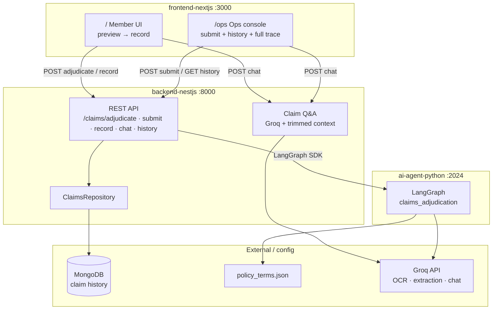
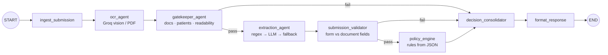
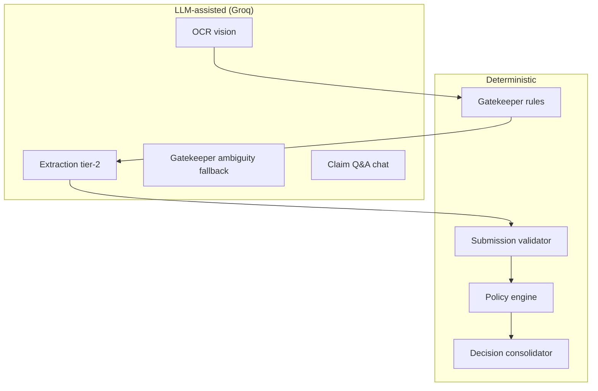
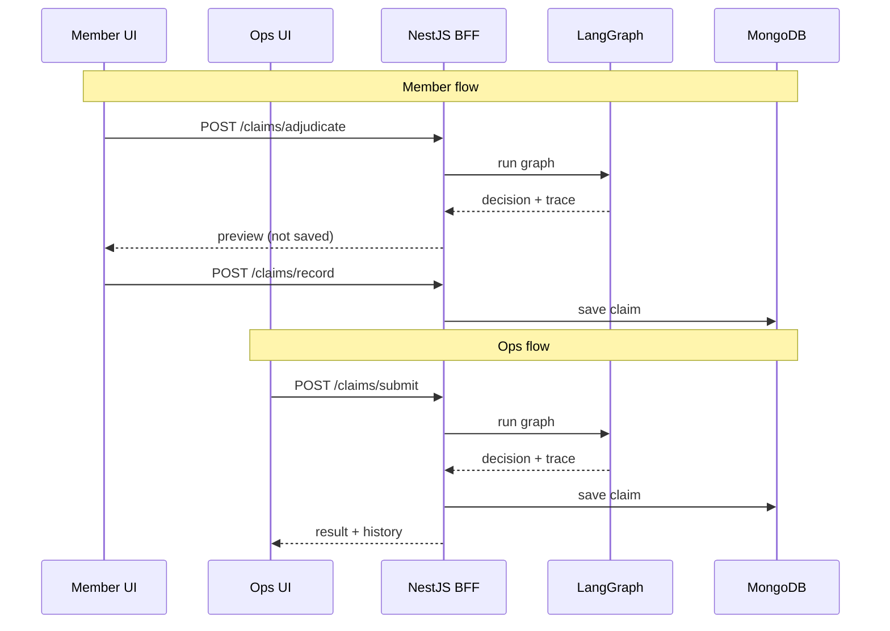

# Architecture Document — Plum Claims Adjudication

## Problem

Employees submit health insurance claims with medical documents (bills, prescriptions, lab reports). Today this is reviewed manually against policy terms. This system automates document validation, information extraction, policy evaluation, and decision-making — with a full audit trail for operations teams.

## Design goals

1. **Stop bad submissions early** — wrong or unreadable documents never reach policy logic.
2. **Explain every decision** — ops can reconstruct the full path from submission to outcome.
3. **Degrade gracefully** — LLM/OCR failures reduce confidence and surface degraded steps; the pipeline does not crash.
4. **Policy-driven** — all coverage rules load from `policy_terms.json`; no hardcoded limits or exclusions.
5. **Separate concerns** — deterministic rules where possible; LLMs for OCR, ambiguous document types, and tier-2 extraction only.

## High-level architecture

### Why three services?

| Layer | Rationale |
|-------|-----------|
| **LangGraph (Python)** | Assignment is AI-heavy; LangGraph gives visible multi-step pipeline, Studio debugging, and clean agent boundaries. Policy engine stays deterministic Python. |
| **NestJS BFF** | Handles auth-ready REST, MongoDB, file payload forwarding, and chat without bloating the graph. Frontend never talks to LangGraph directly. |
| **Next.js UI** | Single codebase for member and ops views (`viewCapabilities` toggles trace depth, record flow, history sidebar). |

## Adjudication pipeline (LangGraph)

Each node appends a `TraceEntry` to state. Failed gatekeeper or submission validator routes directly to `decision_consolidator` (early stop).

**Early stop:** If gatekeeper fails → skip extraction, submission validation, and policy → `PENDING`. If submission validator fails (form date/hospital mismatch) → skip policy → `PENDING`. In both cases the member fixes input rather than receiving a final rejection.

### Component types

### Component responsibilities

| Node | Type | Responsibility |
|------|------|----------------|
| **ingest_submission** | Deterministic | Parse input, initialize state |
| **ocr_agent** | LLM (Groq vision) | Extract raw text from images/PDFs; return `UNREADABLE` for illegible images |
| **gatekeeper_agent** | Deterministic + optional LLM | Required doc types per category, unreadable detection, patient name match, member ID roster check |
| **extraction_agent** | Regex + LLM | Structured fields: patient, diagnosis, line items, amounts |
| **submission_validator** | Deterministic | Cross-check form treatment date and hospital name against extracted document data |
| **policy_engine** | Deterministic | Waiting periods, exclusions, co-pay, sub-limits, pre-auth, network discount, fraud signals |
| **decision_consolidator** | Deterministic | Merge policy result, apply confidence penalties for degraded steps |
| **format_response** | Deterministic | Build `AdjudicationResponse` |

### Decision types

| Decision | When |
|----------|------|
| `PENDING` | Gatekeeper or submission validator early stop — member must fix documents or form fields (not a final rejection) |
| `APPROVED` | Full coverage after policy rules |
| `PARTIAL` | Some line items excluded (e.g. cosmetic dental) |
| `REJECTED` | Policy exclusion, waiting period, limit exceeded, etc. |
| `MANUAL_REVIEW` | Fraud signals or degraded components |

## Key design decisions

### 1. Deterministic gatekeeper first, LLM only for ambiguity

**Chosen:** Rule-based validation (`document_validator.py`) handles missing docs, wrong types, unreadable files, and patient mismatches. LLM gatekeeper runs only when document types are ambiguous.

**Rejected:** Full LLM gatekeeper — slower, less predictable, harder to test.

### 2. Tiered extraction

**Chosen:** Regex/label parsing (tier 1) → Groq structured extraction (tier 2) → fallback with reduced confidence (tier 3).

**Rejected:** LLM-only extraction — expensive and brittle on clean test cases with pre-filled text.

### 3. Policy engine as pure Python

**Chosen:** `DynamicPolicyEngine` reads JSON and applies rules in code. Fully unit-testable without API calls.

**Rejected:** LLM-as-policy-judge — not auditable for regulated insurance logic.

### 4. Member two-step submit

**Chosen:** Member calls `adjudicate` (preview) then `record` (persist). Ops calls `submit` (adjudicate + save in one step).

**Rationale:** Members see decision before committing; ops workflow stays fast.

### 5. MongoDB for history, not for adjudication state

LangGraph uses in-memory thread persistence in local dev (LangGraph Studio). Claim records are stored in MongoDB after adjudication for ops history and chat context.

## Observability

Every claim response includes:

- `execution_trace[]` — step name, status, message, details, degraded flag
- `confidence_score` — reduced when OCR, extraction, or gatekeeper LLM degrades
- `financial_breakdown` — co-pay, network discount, submitted vs document amounts
- `rejection_reasons[]` — machine-readable policy failures
- `line_item_decisions[]` — per-item approve/exclude for PARTIAL claims

Ops UI shows full trace with expandable JSON details. Member UI shows friendly summaries and hides internal jargon.

## Failure handling

| Failure | Behavior |
|---------|----------|
| OCR timeout / empty | Mark degraded; gatekeeper flags unreadable |
| Extraction LLM failure | Fall back to regex; lower confidence; TC011 still approves with confidence 0.6 |
| Gatekeeper LLM failure | Route to MANUAL_REVIEW |
| LangGraph unreachable | BFF returns 503; frontend shows reconnect message |
| MongoDB save failure (ops submit) | Decision still returned; error logged |

## Trade-offs and limitations

| Limitation | Current impact | At 10× load |
|------------|----------------|-------------|
| Sync LangGraph invoke per claim | Fine for demo; blocks BFF thread | Queue claims (SQS/Redis), worker pool of graph runners |
| Groq vision OCR | Good on synthetic samples; blur/handwriting variable | Dedicated OCR service (Textract/Google Doc AI) + human review queue |
| Single policy file | One policy per deployment | Policy version store, member→policy lookup service |
| No auth | Open local API | JWT + member ID verification at BFF |
| In-memory graph | No cross-request state | Horizontal scale LangGraph workers behind load balancer |
| Chat context trimming | Strips base64 from context | Store document refs in object storage, cite by ID |

## Scaling path (10× load)

1. **Async claim queue** — POST returns `claim_id` + status; poll or webhook on completion.
2. **OCR microservice** — Separate GPU/vision pipeline with caching by document hash.
3. **Policy engine cache** — Load policy once per worker; hot-reload on version change.
4. **Read replicas** — MongoDB for history; separate analytics store for ops dashboards.
5. **Rate limiting** — Per-member submission caps; fraud graph pre-filter before full pipeline.

## Testing strategy

| Layer | Coverage |
|-------|----------|
| Gatekeeper | Unit tests — wrong doc, patient mismatch, unreadable, member roster |
| Submission validator | Unit tests — treatment date mismatch, hospital name mismatch, inconsistent doc dates |
| Policy engine | Unit tests — co-pay, waiting period, exclusions, limits, network discount |
| Extraction | Unit tests — dental markdown, LLM output coercion |
| OCR | Unit + integration — Groq vision on sample JPGs |
| End-to-end | 12 assignment cases + 7 OCR image cases (32 pytest unit tests total) |

See [EVAL_REPORT.md](./EVAL_REPORT.md) for full assignment case results.

## Technology choices

| Choice | Alternative considered | Why chosen |
|--------|-------------------------|------------|
| LangGraph | Custom orchestrator | Visible graph, conditional routing, Studio debugging |
| Groq | OpenAI, local models | Fast inference, free tier, vision model for OCR |
| NestJS | FastAPI-only monolith | Team-familiar BFF pattern, validation, MongoDB integration |
| MongoDB | PostgreSQL | Flexible schema for traces + submission payloads |
| Tailwind v4 | Component library | Lightweight, matches assignment UI requirements |
