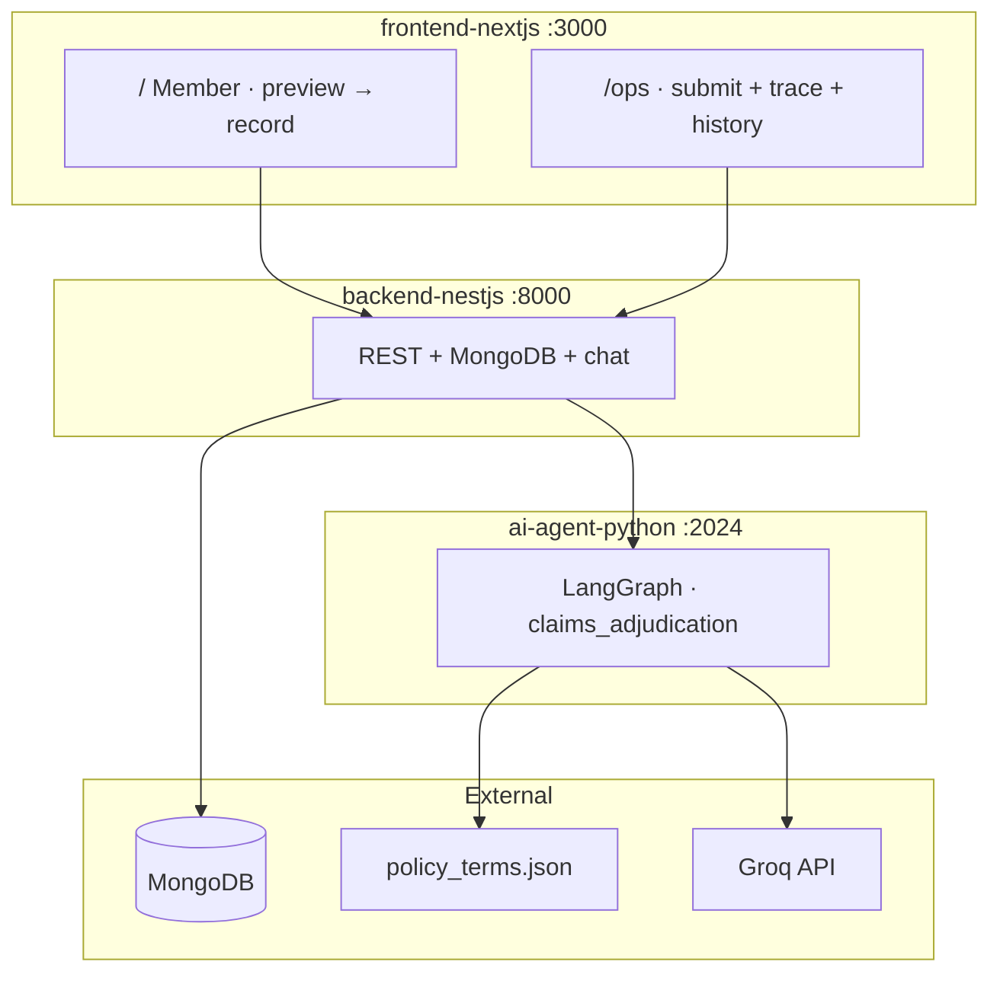
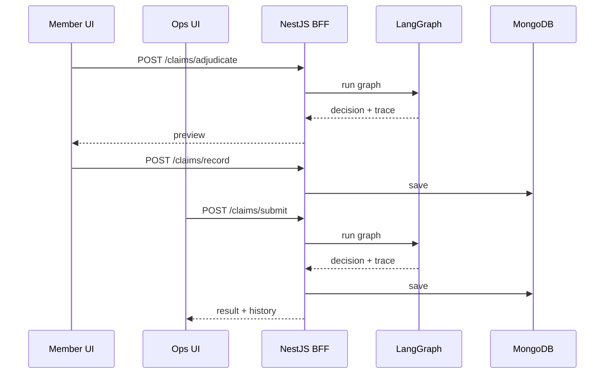
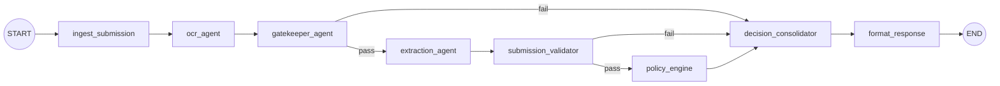

# Plum Health Insurance Claims Platform

Automated, **explainable** health insurance claims adjudication — built for Plum's AI Engineer assignment. The system accepts claims with medical documents, stops bad submissions early, extracts structured data, applies policy rules from JSON, and returns every decision with a full execution trace.

**Results:** [12/12 assignment cases](./EVAL_REPORT.md) · [7/7 OCR image cases](./EVAL_REPORT.md) · 50 unit tests (`uv run pytest`)

---

## Submission at a glance

| # | Assignment deliverable | Where to find it | Status |
|---|------------------------|------------------|--------|
| **1** | Working system (UI + setup / deploy) | This README → [§ Deliverable 1](#deliverable-1--working-system) · [Live app](https://plum-ai-health-app.vercel.app/) |
| **2** | Architecture document | This README → [§ Deliverable 2](#deliverable-2--architecture-document) · [ARCHITECTURE.md](./ARCHITECTURE.md) | Components, trade-offs, 10× scaling |
| **3** | Component contracts | [COMPONENT_CONTRACTS.md](./COMPONENT_CONTRACTS.md) | Input / output / errors per component |
| **4** | Eval report | [EVAL_REPORT.md](./EVAL_REPORT.md) | Decision + full trace + pass/fail per case |
| **5** | Demo video (8–12 min) | [demo_video_script.txt](./demo_video_script.txt) | TC001 early stop · TC004 approval · proud / change |

**Repository:** GitHub/GitLab link *(add your URL)*  
**Live deployment:**

| Service | URL |
|---------|-----|
| **Frontend** (member + ops) | [https://plum-ai-health-app.vercel.app/](https://plum-ai-health-app.vercel.app/) |
| **Ops console** | [https://plum-ai-health-app.vercel.app/ops](https://plum-ai-health-app.vercel.app/ops) |
| **Backend** (NestJS BFF) | [https://plum-ai-health-app.onrender.com](https://plum-ai-health-app.onrender.com) |
| **Python agent** (LangGraph) | [https://plum-ai-health-app-1.onrender.com](https://plum-ai-health-app-1.onrender.com) |

**Demo video:** *(add YouTube / Loom link after recording)*

---

## How the assignment requirements are met

The assignment defines six non-negotiable behaviors. Here is where each lives in this codebase.

| Requirement | What we built | Proof |
|-------------|---------------|-------|
| **1. Accept claim submission** | Member UI (`/`) preview → record; ops UI (`/ops`) submit + history | `frontend-nextjs`, `POST /claims/adjudicate` · `submit` |
| **2. Catch document problems early** | `gatekeeper_agent` stops before policy; specific messages, not generic errors | TC001–TC003 in [EVAL_REPORT.md](./EVAL_REPORT.md); `used_llm: false` on TC001 |
| **3. Extract structured information** | `ocr_agent` (Groq vision) + `extraction_agent` (LLM-first, regex gap-fill) | TC004 extraction trace; OCR-001–OCR-007 on real JPGs |
| **4. Make a claim decision** | `policy_engine` → `APPROVED` · `PARTIAL` · `REJECTED` · `MANUAL_REVIEW` · `PENDING` | All 12 cases; amounts + confidence on every response |
| **5. Explain every decision** | `execution_trace[]` on every response; ops `reason` + member `member_reason` | Any case in EVAL_REPORT; ops trace panel in `/ops` |
| **6. Handle failures gracefully** | Degraded steps → lower confidence; pipeline never crashes | TC011: extraction degrades, still `APPROVED` at confidence 0.6 |

Policy and member data are read from **`policy_terms.json`** (assignment file, mirrored at `ai-agent-python/config/policy_terms.json`). Clinical intent phrases (exclusions, waiting conditions, pre-auth tests) live in `policy/rules_config.py` — the policy JSON is **not modified**.

---

## Deliverable 1 — Working System

### What you can run today

### Live deployment

| URL | Service |
|-----|---------|
| [https://plum-ai-health-app.vercel.app/](https://plum-ai-health-app.vercel.app/) | **Member UI** — submit claim → preview → record |
| [https://plum-ai-health-app.vercel.app/ops](https://plum-ai-health-app.vercel.app/ops) | **Ops console** — test cases · full trace · history |
| [https://plum-ai-health-app.onrender.com/api/v1](https://plum-ai-health-app.onrender.com/api/v1) | **NestJS BFF** (backend) |
| [https://plum-ai-health-app-1.onrender.com](https://plum-ai-health-app-1.onrender.com) | **LangGraph agent** (Python) |

### Local development

| URL | Audience | Flow |
|-----|----------|------|
| `http://localhost:3000` | **Member** | Submit claim → preview decision → record to Plum |
| `http://localhost:3000/ops` | **Operations** | Run test cases · adjudicate + save · full trace · history · HITL approve |
| `http://localhost:8000/api/v1` | **BFF API** | REST + MongoDB + claim Q&A chat |
| `http://localhost:2024` | **LangGraph** | Adjudication graph + Studio |

**Member experience:** plain-English outcomes (`member_reason`), line-item breakdown, “what happens next” — no internal codes like `COSMETIC_EXCLUSION`.

**Ops experience:** full `execution_trace`, financial breakdown, rejection codes, demo sidebar (TC001–TC012), claim history from MongoDB.

### Decision types

| Decision | Meaning for the member |
|----------|------------------------|
| `PENDING` | Fix documents or form fields — **not** a final rejection |
| `APPROVED` | Full coverage after policy rules |
| `PARTIAL` | Some line items covered, others excluded (e.g. cosmetic dental) |
| `REJECTED` | Policy exclusion, waiting period, limit exceeded |
| `MANUAL_REVIEW` | Fraud signals or degraded AI — human review needed |

### Local setup

**Prerequisites:** Node.js 18+, Python 3.11+, [uv](https://docs.astral.sh/uv/), MongoDB, [Groq API key](https://console.groq.com)

```bash
git clone <your-repo-url>
cd plum-ai-health-app

cp ai-agent-python/.env.example ai-agent-python/.env
cp backend-nestjs/.env.example backend-nestjs/.env
cp frontend-nextjs/.env.example frontend-nextjs/.env
# Set GROQ_API_KEY in ai-agent-python/.env and backend-nestjs/.env

cd ai-agent-python && uv sync && cd ..
cd backend-nestjs && npm install && cd ..
cd frontend-nextjs && npm install && cd ..
```

**Start (3 terminals):**

```bash
cd ai-agent-python && uv run langgraph dev --allow-blocking
cd backend-nestjs && npm run build && npm start
cd frontend-nextjs && npm run dev
```

| Service | Port | Key env vars |
|---------|------|--------------|
| LangGraph agent | 2024 | `GROQ_API_KEY` |
| NestJS BFF | 8000 | `MONGODB_URI`, `LANGGRAPH_BASE_URL`, `GROQ_API_KEY` |
| Next.js UI | 3000 | `NEXT_PUBLIC_API_URL=http://localhost:8000/api/v1` |

### Deployment

```
Frontend (Vercel) → Backend (Render) → Agent (Render)
https://plum-ai-health-app.vercel.app → https://plum-ai-health-app.onrender.com → https://plum-ai-health-app-1.onrender.com
```

| Service | Root dir | Build | Start |
|---------|----------|-------|-------|
| Agent | `ai-agent-python` | `uv sync --frozen --extra dev` | `uv run langgraph dev --host 0.0.0.0 --port $PORT --allow-blocking --no-reload` |
| BFF | `backend-nestjs` | `npm install && npm run build` | `npm start` |
| Frontend | `frontend-nextjs` | Vercel default | Vercel default |

**Production env vars:**

| Host | Variable | Value |
|------|----------|-------|
| Vercel (frontend) | `NEXT_PUBLIC_API_URL` | `https://plum-ai-health-app.onrender.com/api/v1` |
| Render (backend) | `LANGGRAPH_BASE_URL` | `https://plum-ai-health-app-1.onrender.com` |
| Render (backend) | `CORS_ORIGINS` | `https://plum-ai-health-app.vercel.app` |
| Render (agent + backend) | `GROQ_API_KEY` | your Groq key |
| Render (backend) | `MONGODB_URI` | your MongoDB Atlas URI |

### Troubleshooting

| Problem | Fix |
|---------|-----|
| Failed to fetch | Start backend; check `NEXT_PUBLIC_API_URL` |
| 503 LangGraph | Start agent or fix `LANGGRAPH_BASE_URL` |
| MongoDB error | Start local Mongo or set Atlas `MONGODB_URI` |
| OCR / eval fails | Check `GROQ_API_KEY`; Groq free tier has daily token limits |

---

## Deliverable 2 — Architecture Document

> Full write-up: **[ARCHITECTURE.md](./ARCHITECTURE.md)**

### Components and how they interact



| Service | Stack | Role |
|---------|-------|------|
| **ai-agent-python** | LangGraph + Groq | 8-node adjudication pipeline — OCR, gatekeeper, extraction, policy |
| **backend-nestjs** | NestJS + MongoDB | BFF — REST, persistence, claim Q&A; UI never calls LangGraph directly |
| **frontend-nextjs** | Next.js 15 + Tailwind v4 | Member + ops views via `viewCapabilities` |



### LangGraph pipeline (the adjudication brain)

Graph ID: **`claims_adjudication`**. Each node appends a `TraceEntry` to shared state.



| Node | Type | Responsibility |
|------|------|----------------|
| ingest_submission | Deterministic | Parse input, initialize state |
| ocr_agent | Groq vision | Text from images/PDFs |
| gatekeeper_agent | Rules + optional LLM | Required doc types, readability, patient/roster |
| extraction_agent | LLM-first → regex gap-fill | Patient, diagnosis, line items, amounts |
| submission_validator | Deterministic | Form date / hospital vs documents |
| policy_engine | Deterministic | Waiting periods, co-pay, limits, line items, fraud |
| decision_consolidator | Deterministic | Final decision, confidence penalties |
| format_response | Deterministic | API response + `member_reason` |

**Early stop:** Gatekeeper or submission validator failure → `PENDING`, skips policy. Wrong documents never reach adjudication logic.

**LLM usage:** Groq for OCR, extraction, gatekeeper ambiguity, and chat. **Policy is pure Python** — auditable, unit-testable, no LLM-as-judge.

### Why designed this way

| Decision | Chosen | Rejected |
|----------|--------|----------|
| Document validation | Deterministic gatekeeper; LLM only for ambiguity | Full LLM gatekeeper |
| Extraction | LLM-first for uploads; regex for prefilled fixtures | LLM-only or regex-only |
| Policy | JSON for limits/roster; intent rules in code | LLM-as-policy-judge |
| Architecture | 3 services (UI / BFF / agent) | Single FastAPI monolith |
| Member flow | Preview then record | Single submit without preview |

**Proud of:** Gatekeeper-first design — TC001–TC003 pass with `used_llm: false`; 50 unit tests run without an API key for policy/gatekeeper paths.

### Limitations and 10× load

| Today | At 10× load |
|-------|-------------|
| Sync LangGraph invoke per claim | Async queue (SQS/Redis) + worker pool + poll/webhook |
| Groq vision OCR | Dedicated OCR service + document-hash cache |
| Single policy file | Policy version store + member→policy lookup |
| No auth | JWT + member verification at BFF |
| In-memory graph | Horizontal LangGraph workers behind load balancer |

Extended failure modes, scaling path, and technology rationale: **[ARCHITECTURE.md](./ARCHITECTURE.md)**.

---

## Deliverable 3 — Component Contracts

> Full contracts: **[COMPONENT_CONTRACTS.md](./COMPONENT_CONTRACTS.md)**

For every significant component: **input**, **output**, **errors** — precise enough to reimplement without reading source code.

### Component map (matches trace order)

| Order | Component | Input → Output |
|-------|-----------|----------------|
| — | Claim submission | Form + documents → BFF → LangGraph |
| — | Adjudication response | Graph → BFF → UI (`execution_trace[]`, `reason`, `member_reason`) |
| 1 | OCR agent | Images/PDFs → `content_summary` |
| 2 | Gatekeeper agent | Documents → pass/fail + **specific** error message |
| 3 | Extraction agent | Text → structured fields (patient, amounts, diagnosis) |
| 4 | Submission validator | Form vs extracted data → pass/fail |
| 5 | Policy engine | Submission + extracted → decision + financial breakdown |
| 6 | Decision consolidator | Policy + degraded steps → final confidence |
| 7 | Format response | State → `AdjudicationResponse` |
| — | BFF REST API | HTTP endpoints (adjudicate, submit, record, chat, history) |
| — | Frontend views | Member friendly vs ops full trace |

### Dual-audience messaging (output contract)

| Field | Audience | Example (TC006) |
|-------|----------|-----------------|
| `reason` | Ops / audit | `…Teeth Whitening: COSMETIC_EXCLUSION` |
| `member_reason` | Member UI / chat | `We approved ₹8,000… cosmetic dental procedures aren't covered…` |
| `execution_trace[]` | Ops | Step-by-step gatekeeper → policy → decision |
| `line_item_decisions[]` | Ops | Per-item approve/reject with codes |
| `financial_breakdown` | Ops | Co-pay, network discount, limits |

Canonical schemas: `ai-agent-python/src/schemas.py`. BFF DTOs: `backend-nestjs/src/claims/dto/`.

---

## Deliverable 4 — Eval Report

> Full report: **[EVAL_REPORT.md](./EVAL_REPORT.md)**

Ran all **12 cases** from `assignment/test_cases.json` plus **7 OCR image cases** from `sample-documents/ocr_test_cases.json`.

### Summary

| Suite | Result |
|-------|--------|
| Assignment (TC001–TC012) | **12/12 PASS** |
| OCR images (OCR-001–OCR-007) | **7/7 PASS** |
| Unit tests | **50** (`uv run pytest`) |

### What each case section contains

For every case the report shows:

1. **Expected outcome** (decision, amount, system_must rules)
2. **Actual result** — decision, approved amount, confidence, pass/fail
3. **Reason (ops / audit)** — technical rationale for reviewers
4. **Member-facing summary** — plain-language `member_reason`
5. **Full execution trace** — every step, message, and JSON details

No mismatches in the current run — if a case failed, the generator would document failures inline.

### Cases worth highlighting in review

| Case | What it proves |
|------|----------------|
| **TC001** | Early stop — wrong doc type, specific message, 5-step trace (no policy) |
| **TC004** | Full approval — 8-step trace, co-pay ₹1,350 on ₹1,500 |
| **TC006** | Partial — line-item cosmetic exclusion, ₹8,000 approved |
| **TC011** | Graceful degradation — extraction fails, still approves at confidence 0.6 |
| **OCR-001** | Real JPG consultation bill through Groq vision OCR |

### Reproduce the report

```bash
cd ai-agent-python

uv run pytest
uv run python scripts/run_test_cases.py
uv run python scripts/run_ocr_test_cases.py          # needs GROQ_API_KEY
uv run python scripts/generate_eval_report.py        # full regen
uv run python scripts/generate_eval_report.py --skip-ocr   # assignment only; keeps OCR sections
```

---

## Deliverable 5 — Demo Video

**Assignment asks for 8–12 minutes** covering:

1. A claim **stopped early** due to a document problem — show the **specific error message**
2. A **successful end-to-end approval** with the **full trace visible**
3. One technical decision you are **proud of** and one you would **change**

**Suggested recording:** TC001 (early stop) + TC004 (full approval) on `http://localhost:3000/ops`.

Word-for-word script with timings: **[demo_video_script.txt](./demo_video_script.txt)**

---

## API reference

Base URL: `http://localhost:8000/api/v1`

| Method | Path | Description |
|--------|------|-------------|
| `POST` | `/claims/adjudicate` | Run adjudication — member preview |
| `POST` | `/claims/record` | Persist a previewed claim |
| `POST` | `/claims/submit` | Adjudicate + save — ops flow |
| `POST` | `/claims/approve` | Ops settlement approval (HITL) |
| `POST` | `/claims/chat` | Q&A about a claim result |
| `GET` | `/claims/history` | List past claims |
| `GET` | `/claims/:claimId` | Full claim with execution trace |

---

## Project structure

```
plum-ai-health-app/
├── ai-agent-python/          # LangGraph adjudication pipeline
├── backend-nestjs/           # NestJS BFF + MongoDB
├── frontend-nextjs/          # Member + ops UI
├── assignment/               # Brief, test_cases.json, policy_terms.json
├── sample-documents/         # OCR test images
├── ARCHITECTURE.md           # Deliverable 2 (extended)
├── COMPONENT_CONTRACTS.md    # Deliverable 3
├── EVAL_REPORT.md            # Deliverable 4
├── demo_video_script.txt       # Deliverable 5 script
└── README.md                 # This file — submission index + Deliverables 1–2 summary
```

---

## Tech stack

| Technology | Purpose |
|------------|---------|
| **LangGraph** | Multi-step pipeline with conditional routing (multi-agent bonus) |
| **Groq** | OCR, extraction, gatekeeper LLM, claim Q&A |
| **NestJS** | REST BFF, validation, MongoDB |
| **Next.js 15 + Tailwind v4** | Member and ops interfaces |
| **MongoDB** | Claim history and execution traces |
| **uv** | Python dependency management |
