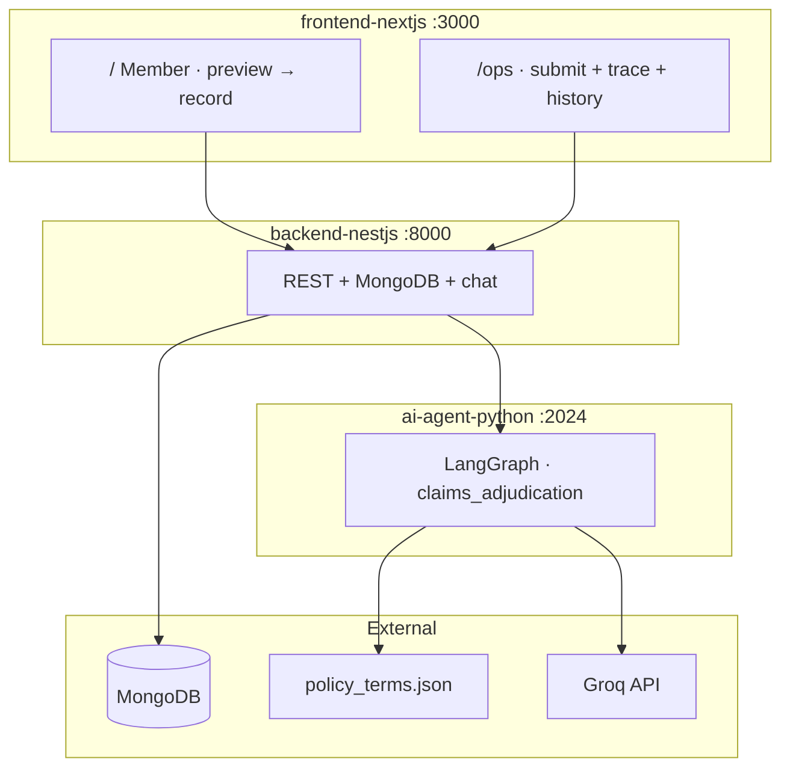
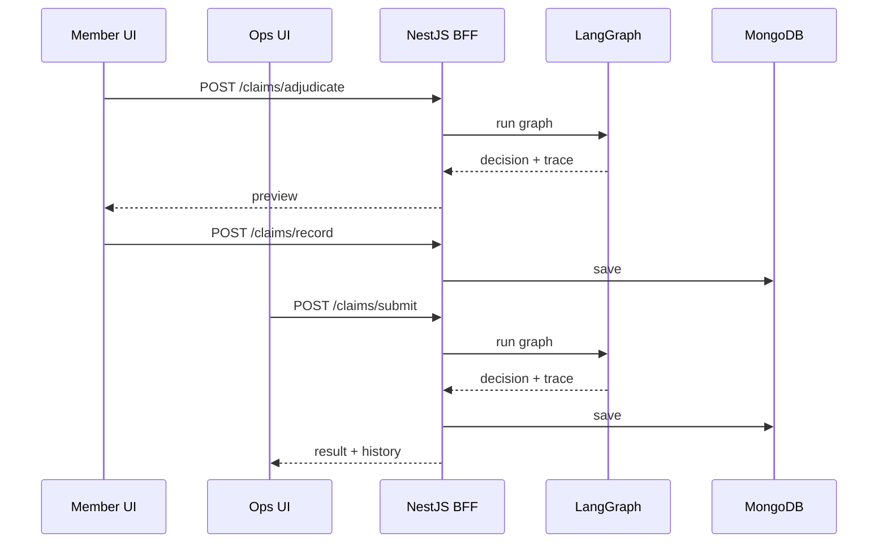
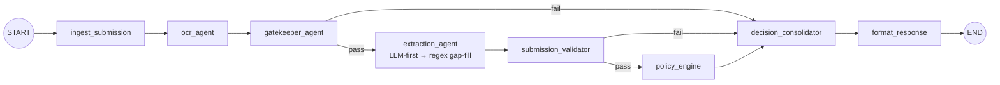

# Plum Health Insurance Claims Platform

Automated health insurance claims adjudication for Plum's AI Engineer assignment. The system accepts claim submissions with medical documents, validates them early, extracts structured data, applies policy rules from JSON, and returns explainable decisions with a full execution trace.

**Evaluation: 12/12 assignment test cases + 7/7 OCR image cases pass** — see [EVAL_REPORT.md](./EVAL_REPORT.md).

---

## Overview

When an employee submits a health insurance claim, they upload medical documents — bills, prescriptions, lab reports — along with basic details. This system automates the review process: document validation, information extraction, policy evaluation, and decision-making, with a complete audit trail for operations teams.

| Requirement | Implementation |
|-------------|----------------|
| Accept claim submissions | Member UI (`/`) and ops console (`/ops`) |
| Catch document problems early | `gatekeeper_agent` → `PENDING` with specific, actionable messages |
| Extract structured information | `ocr_agent` (Groq vision) + LLM-first `extraction_agent` (regex gap-fill for prefilled fixtures) |
| Make claim decisions | `policy_engine` — limits/coverage from `policy_terms.json`; intent rules in `policy/rules_config.py` |
| Explain every decision | `execution_trace[]` on every response |
| Handle failures gracefully | Degraded steps reduce confidence; pipeline never crashes |

### Decision types

| Decision | Meaning |
|----------|---------|
| `PENDING` | Fix documents or form fields — not a final rejection |
| `APPROVED` | Full coverage after policy rules |
| `PARTIAL` | Some line items excluded (e.g. cosmetic dental) |
| `REJECTED` | Policy exclusion, waiting period, limit exceeded |
| `MANUAL_REVIEW` | Fraud signals or degraded AI components |

### Application URLs

| URL | Audience | Description |
|-----|----------|-------------|
| `http://localhost:3000` | Member | Submit claim → preview decision → record |
| `http://localhost:3000/ops` | Operations | Adjudicate + save, full trace, history, test cases |

---

## Architecture

Three services — the frontend never communicates with LangGraph directly.



| Service | Stack | Port | Role |
|---------|-------|------|------|
| **ai-agent-python** | LangGraph + Groq | 2024 | Adjudication pipeline — OCR, gatekeeper, extraction, policy |
| **backend-nestjs** | NestJS + MongoDB | 8000 | BFF — REST API, persistence, claim Q&A chat |
| **frontend-nextjs** | Next.js 15 + Tailwind v4 | 3000 | Member + ops UI |

### Why three services?

- **LangGraph (Python)** — Multi-step AI pipeline with visible graph, Studio debugging, and deterministic policy logic in Python.
- **NestJS BFF** — REST APIs, MongoDB, file forwarding, and chat without coupling the UI to the agent.
- **Next.js** — Single codebase with `viewCapabilities` toggling member-friendly vs ops audit views.

### Request flows



Policy rules load from `ai-agent-python/config/policy_terms.json` (mirrors `assignment/policy_terms.json`). Coverage, co-pay, waiting periods, exclusions, and member roster are configuration — not hardcoded.

---

## LangGraph pipeline

Graph ID: `claims_adjudication`. Each node appends a `TraceEntry` to shared state.



| Node | Type | Responsibility |
|------|------|----------------|
| **ingest_submission** | Deterministic | Parse input, initialize state |
| **ocr_agent** | Groq vision | Extract text from images/PDFs |
| **gatekeeper_agent** | Rules + optional LLM | Required doc types, readability, patient/roster match |
| **extraction_agent** | LLM-first → regex gap-fill | Patient, diagnosis, line items, amounts |
| **submission_validator** | Deterministic | Cross-check form date and hospital vs documents |
| **policy_engine** | Deterministic | Waiting periods, co-pay, limits, intent-based exclusions, fraud |
| **decision_consolidator** | Deterministic | Final decision, confidence penalties |
| **format_response** | Deterministic | Build API response |

**Early stop:** Gatekeeper or submission validator failure → `PENDING`, skips policy. Wrong documents never reach adjudication logic.

**LLM usage:** Groq for OCR, extraction (primary path for uploaded images), gatekeeper ambiguity, and claim Q&A. Policy adjudication is pure Python — coverage/roster/limits from JSON; clinical intent matching in `policy/rules_config.py` (policy file unchanged).

### Example outcomes

**TC001 — wrong document (early stop):** Two prescriptions submitted for a CONSULTATION claim that requires a hospital bill. Decision `PENDING`, gatekeeper fails with a specific message. Trace: 5 steps — extraction and policy never run.

**TC004 — clean approval:** Valid consultation with prescription + hospital bill. Decision `APPROVED`, ₹1,350 after 10% co-pay. Trace: 8 steps through the full pipeline.

Full traces for all 12 cases: [EVAL_REPORT.md](./EVAL_REPORT.md).

---

## Design decisions

| Decision | Chosen | Rejected |
|----------|--------|----------|
| Document validation | Deterministic gatekeeper; LLM only for ambiguity | Full LLM gatekeeper |
| Extraction | LLM-first for OCR/free-form; regex gap-fill for structured prefilled fixtures | LLM-only or regex-only extraction |
| Policy | JSON for limits/roster/coverage; intent rules in code (`policy/rules_config.py`) | LLM-as-policy-judge or editing assignment policy JSON |
| Architecture | 3 services (UI / BFF / agent) | Single monolith |
| Member submit | Preview then record | Single submit without preview |

### Key trade-offs

**Deterministic gatekeeper first** — Rules in `document_validator.py` and `document_type.py` handle missing docs, wrong types, unreadable files, and patient mismatches. Document types are inferred via intent scoring; LLM runs when type is `UNKNOWN` or low confidence. TC001–TC003 pass with `used_llm: false`. 48 unit tests run without an API key for gatekeeper/policy paths.

**Async queue at scale** — Current design uses synchronous LangGraph invoke per claim. At higher volume, claims would be queued (SQS/Redis) with worker pools and poll/webhook completion.

### Limitations & 10× scaling

| Today | At 10× load |
|-------|-------------|
| Sync invoke per claim | Async queue + worker pool |
| Groq vision OCR | Dedicated OCR service + document-hash cache |
| Single policy file | Policy version store |
| No auth | JWT + member verification at BFF |

Extended rationale: [ARCHITECTURE.md](./ARCHITECTURE.md).

---

## Local setup

**Prerequisites:** Node.js 18+, Python 3.11+, [uv](https://docs.astral.sh/uv/), MongoDB, [Groq API key](https://console.groq.com)

```bash
git clone <your-repo-url>
cd plum-claims-platform

cp ai-agent-python/.env.example ai-agent-python/.env
cp backend-nestjs/.env.example backend-nestjs/.env
cp frontend-nextjs/.env.example frontend-nextjs/.env
# Set GROQ_API_KEY in ai-agent-python/.env and backend-nestjs/.env

cd ai-agent-python && uv sync && cd ..
cd backend-nestjs && npm install && cd ..
cd frontend-nextjs && npm install && cd ..
```

**Start all services (3 terminals):**

```bash
cd ai-agent-python && uv run langgraph dev --allow-blocking
cd backend-nestjs && npm run build && npm start
cd frontend-nextjs && npm run dev
```

| Service | Port | Key environment variables |
|---------|------|---------------------------|
| LangGraph agent | 2024 | `GROQ_API_KEY` |
| NestJS BFF | 8000 | `MONGODB_URI`, `LANGGRAPH_BASE_URL`, `GROQ_API_KEY` |
| Next.js UI | 3000 | `NEXT_PUBLIC_API_URL=http://localhost:8000/api/v1` |

LangGraph Studio: **http://localhost:2024**

### Troubleshooting

| Problem | Fix |
|---------|-----|
| Failed to fetch | Start backend; verify `NEXT_PUBLIC_API_URL` |
| 503 LangGraph | Start agent or check `LANGGRAPH_BASE_URL` |
| MongoDB error | Start local MongoDB or configure Atlas `MONGODB_URI` |

### Deployment

```
Frontend (Vercel) → Backend (Render) → Agent (Render)
```

See [ARCHITECTURE.md](./ARCHITECTURE.md) for Render build and start commands.

---

## API reference

Base URL: `http://localhost:8000/api/v1`

| Method | Path | Description |
|--------|------|-------------|
| `POST` | `/claims/adjudicate` | Run adjudication — member preview |
| `POST` | `/claims/record` | Persist a previewed claim |
| `POST` | `/claims/submit` | Adjudicate + save — ops flow |
| `POST` | `/claims/approve` | Ops settlement approval |
| `POST` | `/claims/chat` | Q&A about a claim result |
| `GET` | `/claims/history` | List past claims |
| `GET` | `/claims/:claimId` | Full claim with execution trace |

Component interfaces: [COMPONENT_CONTRACTS.md](./COMPONENT_CONTRACTS.md).

---

## Testing

```bash
cd ai-agent-python

uv run pytest                              # 48 unit tests
uv run python scripts/run_test_cases.py    # 12 assignment cases
uv run python scripts/run_ocr_test_cases.py  # 7 OCR image cases (requires GROQ_API_KEY)
uv run python scripts/generate_eval_report.py
```

Test inputs: `assignment/test_cases.json`, `sample-documents/ocr_test_cases.json`. Policy config: `assignment/policy_terms.json` (mirrored at `ai-agent-python/config/policy_terms.json`) — **not modified**; intent phrases live in `ai-agent-python/src/policy/rules_config.py`.

---

## Submission deliverables

| Deliverable | Location |
|-------------|----------|
| Working system | This repository — setup above |
| Architecture document | [ARCHITECTURE.md](./ARCHITECTURE.md) |
| Component contracts | [COMPONENT_CONTRACTS.md](./COMPONENT_CONTRACTS.md) |
| Eval report (12/12 + 7/7 OCR) | [EVAL_REPORT.md](./EVAL_REPORT.md) |

---

## Project structure

```
plum-claims-platform/
├── ai-agent-python/       # LangGraph adjudication pipeline
├── backend-nestjs/        # NestJS BFF + MongoDB
├── frontend-nextjs/       # Member + ops UI
├── assignment/            # Brief, test_cases.json, policy_terms.json
├── ARCHITECTURE.md
├── COMPONENT_CONTRACTS.md
├── EVAL_REPORT.md
└── README.md
```

---

## Tech stack

| Technology | Purpose |
|------------|---------|
| **LangGraph** | Multi-step adjudication pipeline with conditional routing |
| **Groq** | OCR, extraction, gatekeeper LLM, claim Q&A |
| **NestJS** | REST BFF, validation, MongoDB |
| **Next.js 15 + Tailwind v4** | Member and ops interfaces |
| **MongoDB** | Claim history and execution traces |
