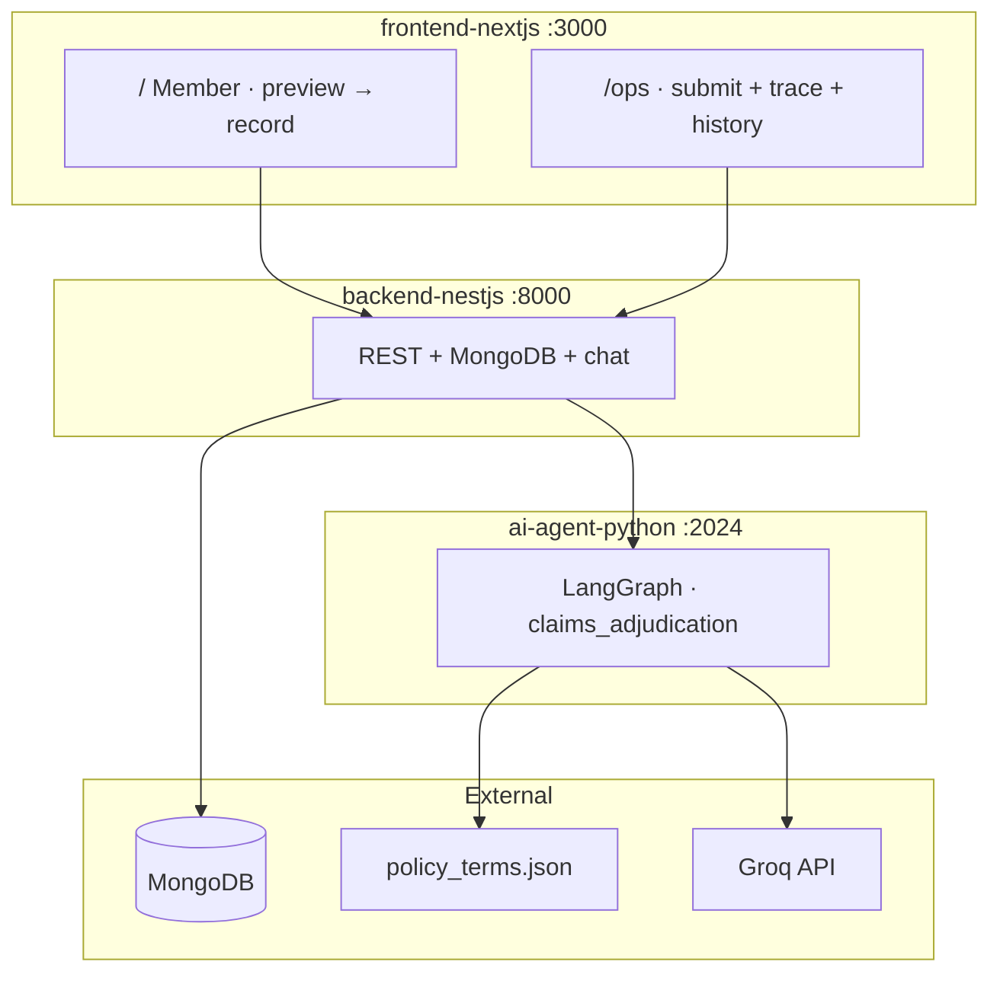
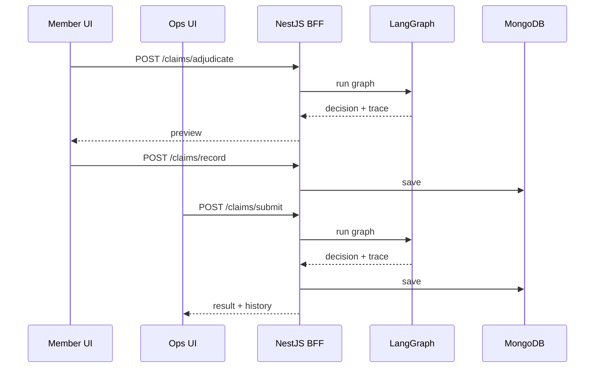
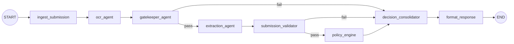
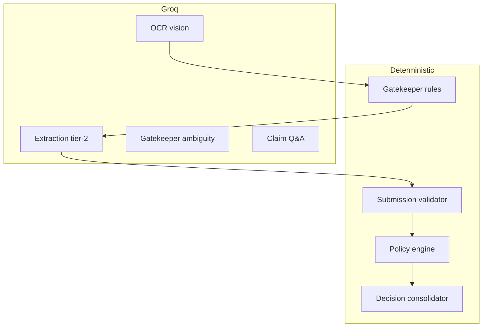

# Plum Health Insurance Claims Platform

Automated claims adjudication for Plum's AI Engineer assignment — document validation, structured extraction, policy rules from JSON, and explainable decisions with a full execution trace.

> **Recording this demo?** Follow sections in order. This README covers **Deliverable 1 (Working System)** and **Deliverable 2 (Architecture)**. Use [COMPONENT_CONTRACTS.md](./COMPONENT_CONTRACTS.md) for contracts and [EVAL_REPORT.md](./EVAL_REPORT.md) for the eval walkthrough. Full narration: [demo_video_script.txt](./demo_video_script.txt).

---

## Before you record — checklist

| # | Action |
|---|--------|
| 1 | Start MongoDB |
| 2 | Terminal 1: `cd ai-agent-python && uv run langgraph dev --allow-blocking` |
| 3 | Terminal 2: `cd backend-nestjs && npm start` |
| 4 | Terminal 3: `cd frontend-nextjs && npm run dev` |
| 5 | Open tabs: [Member UI](http://localhost:3000) · [Ops console](http://localhost:3000/ops) · [LangGraph Studio](http://localhost:2024) (optional) |
| 6 | Ops sidebar ready: **TC001** (early stop) then **TC004** (full approval) |

**Eval result: 12/12 pass** — [EVAL_REPORT.md](./EVAL_REPORT.md)

---

# Deliverable 1 — Working System

> Assignment: *A running application with a UI for claim submission and decision review. Deployed URL or clear local setup instructions.*

## Live application

| URL | Who | What you can do |
|-----|-----|-----------------|
| **http://localhost:3000** | Member | Submit claim → preview decision → save if happy |
| **http://localhost:3000/ops** | Operations | Run test cases, full trace, history, chat, approve for settlement |

### Member flow vs ops flow

| | Member (`/`) | Ops (`/ops`) |
|---|--------------|--------------|
| Submit | `POST /claims/adjudicate` → preview | `POST /claims/submit` → adjudicate + save |
| Save | `POST /claims/record` after preview | Automatic on submit |
| Trace | Friendly summary | Full expandable trace + JSON details |
| Demo cases | — | Sidebar: TC001–TC012 one-click |

## Demo scenario 1 — early stop (TC001)

**Show on:** http://localhost:3000/ops → demo sidebar → **TC001 Wrong Document Uploaded**

| | Expected |
|---|----------|
| Decision | `PENDING` (not rejected — member must fix documents) |
| Approved | ₹0 |
| Message | *"You uploaded 2 Prescription(s) but a Hospital Bill is required for CONSULTATION claims…"* |

**Trace to walk through (5 steps — policy never runs):**

1. `ingest_submission` — SUCCESS  
2. `ocr_agent` — SUCCESS  
3. `gatekeeper_agent` — **FAILED** (`used_llm: false` — pure rules)  
4. `decision_consolidator` — PENDING (`early_stop: true`)  
5. `format_response` — SUCCESS  

**Not in trace:** `extraction_agent`, `submission_validator`, `policy_engine` — conditional router skipped them.

**Optional:** Switch to http://localhost:3000 — same result in plain English for members.

## Demo scenario 2 — full approval (TC004)

**Show on:** http://localhost:3000/ops → **TC004 Clean Consultation — Full Approval**

| | Expected |
|---|----------|
| Decision | `APPROVED` |
| Approved | **₹1,350** (10% co-pay on ₹1,500) |
| Confidence | 0.95 |

**Trace to walk through (8 steps):**

1. `ingest_submission` — SUCCESS  
2. `ocr_agent` — SUCCESS (pre-filled content, no vision API)  
3. `gatekeeper_agent` — SUCCESS  
4. `extraction_agent` — SUCCESS (`tier-1-regex`)  
5. `submission_validator` — SUCCESS  
6. `policy_engine` — APPROVED (co-pay in `financial_breakdown`)  
7. `decision_consolidator` — APPROVED  
8. `format_response` — SUCCESS  

**Optional:** Ask chat *"why was co-pay applied?"* · Show history sidebar with saved run.

## Local setup

**Prerequisites:** Node.js 18+, Python 3.11+, [uv](https://docs.astral.sh/uv/), MongoDB, [Groq API key](https://console.groq.com)

```bash
git clone <your-repo-url>
cd plum-claims-platform

cp ai-agent-python/.env.example ai-agent-python/.env
cp backend-nestjs/.env.example backend-nestjs/.env
cp frontend-nextjs/.env.example frontend-nextjs/.env
# Set GROQ_API_KEY in ai-agent-python/.env and backend-nestjs/.env

cd ai-agent-python && uv sync && cd ..
cd backend-nestjs && npm install && cd ..
cd frontend-nextjs && npm install && cd ..
```

**Start (3 terminals):**

```bash
cd ai-agent-python && uv run langgraph dev --allow-blocking
cd backend-nestjs && npm run build && npm start
cd frontend-nextjs && npm run dev
```

| Service | Port | Env file |
|---------|------|----------|
| LangGraph agent | 2024 | `ai-agent-python/.env` |
| NestJS BFF | 8000 | `backend-nestjs/.env` |
| Next.js UI | 3000 | `frontend-nextjs/.env` |

Key vars: `GROQ_API_KEY`, `MONGODB_URI`, `LANGGRAPH_BASE_URL=http://127.0.0.1:2024`, `NEXT_PUBLIC_API_URL=http://localhost:8000/api/v1`

### Troubleshooting

| Problem | Fix |
|---------|-----|
| Failed to fetch | Start backend; check `NEXT_PUBLIC_API_URL` |
| 503 LangGraph | Start agent or fix `LANGGRAPH_BASE_URL` |
| MongoDB error | Start local Mongo or set Atlas `MONGODB_URI` |

### Deployment (optional)

```
Frontend (Vercel) → Backend (Render :8000) → Agent (Render)
```

See [ARCHITECTURE.md](./ARCHITECTURE.md) for Render build/start commands.

---

# Deliverable 2 — Architecture Document

> Assignment: *Components, interactions, why designed this way, what you rejected, limitations, 10× load.*

## Design goals

1. **Stop bad submissions early** — wrong/unreadable docs never reach policy logic  
2. **Explain every decision** — full `execution_trace` on every response  
3. **Degrade gracefully** — LLM/OCR failures lower confidence; pipeline never crashes  
4. **Policy-driven** — all rules from `policy_terms.json`; nothing hardcoded  
5. **Separate concerns** — LLMs for perception; Python for decisions  

## Tech stack — why three services?



| Service | Stack | Why |
|---------|-------|-----|
| **ai-agent-python** | LangGraph + Groq | AI-heavy pipeline; visible graph; Studio debugging; deterministic policy in Python |
| **backend-nestjs** | NestJS + MongoDB | BFF — REST, persistence, chat; frontend never calls LangGraph directly |
| **frontend-nextjs** | Next.js 15 + Tailwind v4 | One codebase; `viewCapabilities` toggles member vs ops views |

| Choice | Alternative | Why chosen |
|--------|-------------|------------|
| **Groq** | OpenAI, local models | Fast, free tier, vision OCR |
| **MongoDB** | PostgreSQL | Flexible JSON for traces + submissions |
| **LangGraph** | Custom orchestrator | Conditional routing, debuggable multi-step pipeline |

Policy loads from `ai-agent-python/config/policy_terms.json` — co-pay, waiting periods, exclusions, member roster. Change JSON, not code.

## How the pieces talk



- BFF invokes graph via **LangGraph SDK** (`claims_adjudication`)  
- LangGraph down → BFF returns **503**; UI shows reconnect message  
- **Claim Q&A chat** — Groq answers from trimmed adjudication context (no re-run)  

### What we considered and rejected

| Rejected | Why |
|----------|-----|
| Single FastAPI monolith | Mixes AI, persistence, UI — hard to scale graph independently |
| LLM-as-policy-judge | Not auditable for regulated insurance logic |
| Full LLM gatekeeper | Slow, unpredictable; rules-first is testable without API key |

## LangGraph pipeline — 8 nodes

**Show on:** this diagram, LangGraph Studio (http://localhost:2024), or live trace in ops UI.



Each node appends a `TraceEntry` to `execution_trace[]`.

| # | Node | Type | What it does |
|---|------|------|--------------|
| 1 | **ingest_submission** | Deterministic | Parse input, init state; malformed → graceful PENDING |
| 2 | **ocr_agent** | Groq vision | Text from images/PDFs; skip if pre-filled; UNREADABLE → gatekeeper stops |
| 3 | **gatekeeper_agent** | Rules + optional LLM | Required doc types, readability, patient/roster match → **early stop** |
| 4 | **extraction_agent** | Regex → LLM → fallback | Patient, diagnosis, line items, amounts; tier in trace |
| 5 | **submission_validator** | Deterministic | Form date & hospital vs documents → **early stop** if mismatch |
| 6 | **policy_engine** | Deterministic Python | Waiting periods, co-pay, limits, exclusions, fraud — **no LLM** |
| 7 | **decision_consolidator** | Deterministic | Final decision; confidence penalties for degraded steps |
| 8 | **format_response** | Deterministic | Build API response |

### Decision types

| Decision | When |
|----------|------|
| `PENDING` | Gatekeeper or submission validator early stop |
| `APPROVED` | Full coverage after policy |
| `PARTIAL` | Some line items excluded (e.g. cosmetic dental) |
| `REJECTED` | Waiting period, exclusion, limit exceeded |
| `MANUAL_REVIEW` | Fraud signals or degraded AI components |

### LLM vs deterministic



## Technical reflection (for demo closing)

### Proud of: deterministic gatekeeper first

Rules in `document_validator.py` — required types from JSON, patient roster, unreadable detection. LLM only when types are ambiguous. TC001–TC003 pass with `used_llm: false`. **32 unit tests** run without any API key. LLMs for perception; Python for decisions.

### Would change: async claim queue

Today BFF synchronously waits for LangGraph (up to 2 min). At Plum scale → POST returns `claim_id`, SQS/Redis queue, worker pool, poll/webhook. OCR microservice with document-hash cache for resubmissions.

## Limitations & 10× scaling

| Limitation today | At 10× load |
|------------------|-------------|
| Sync invoke per claim | Async queue + worker pool |
| Groq vision OCR | Textract / Doc AI + human review queue |
| Single policy file | Policy version store |
| No auth | JWT at BFF |

Full detail: [ARCHITECTURE.md](./ARCHITECTURE.md)

---

## Other deliverables (show in wrap-up)

| # | Deliverable | File | What to show |
|---|-------------|------|--------------|
| 3 | Component contracts | [COMPONENT_CONTRACTS.md](./COMPONENT_CONTRACTS.md) | I/O per component — gatekeeper, extraction, policy, BFF API |
| 4 | Eval report | [EVAL_REPORT.md](./EVAL_REPORT.md) | 12/12 summary table + TC001/TC004 traces |
| 5 | Demo video | [demo_video_script.txt](./demo_video_script.txt) | Full word-by-word script |

## Testing

```bash
cd ai-agent-python
uv run pytest                              # 32 unit tests
uv run python scripts/run_test_cases.py    # 12/12 assignment cases
uv run python scripts/generate_eval_report.py
```

## Project structure

```
plum-claims-platform/
├── ai-agent-python/       # LangGraph pipeline
├── backend-nestjs/        # NestJS BFF + MongoDB
├── frontend-nextjs/       # Member + ops UI
├── assignment/            # Brief, test_cases.json, policy_terms.json
├── ARCHITECTURE.md        # Extended architecture (same content, more depth)
├── COMPONENT_CONTRACTS.md # Per-component I/O contracts
├── EVAL_REPORT.md         # 12/12 results + full traces
└── demo_video_script.txt  # Narration script
```
